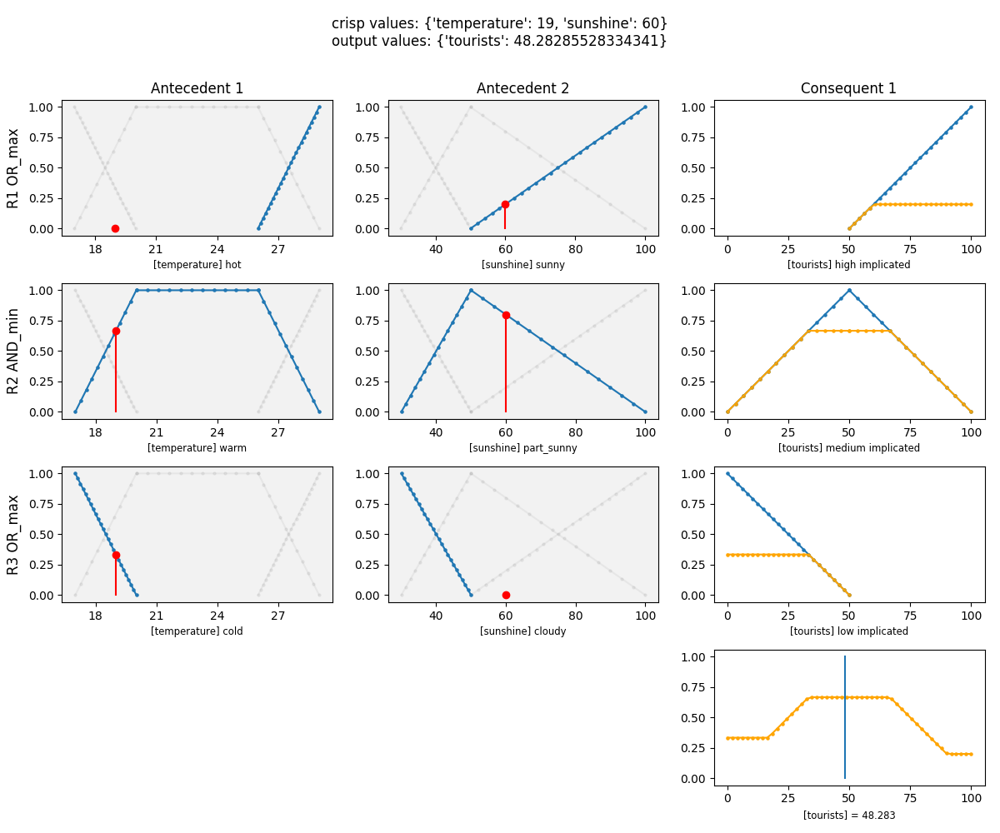

# PyFUGE

**This is a work in progress project, breaking changes will happen. But feel free to try it and report issues :-)**

PyFUGE is basically two things:
* a **Fuzzy System Toolkit** i.e. a set of tools to create, view and play with fuzzy systems. Ideal for students to play with fuzzy systems.
* an implementation of the **FuzzyCoCo algorithm** i.e. a scikit-learn compatible estimator that use a cooperative coevolution algorithm to find and build interpretable fuzzy systems. Designed for both students and researchers.

## Installation

The install instructions can be found here [docs/INSTALL.md](docs/INSTALL.md).

## Fuzzy System Toolkit

### Features

* Singleton and Mamdani fuzzy system types
* Commonly used membership functions (Trap. MF, Triangle MF, Free shape MF,..)
* Multiple consequents
* Default rule
* NOT conditions
* Don't care antecedents
* Viewers (membership function viewer, linguistic variable viewer,...)

### Examples

A list of examples can be found here [pyfuge/fs/examples](pyfuge/fs/examples).

Here is a output example of the resort problem (available in the examples folder).



## FuzzyCoCo algorithm (skFUGE)

The following sentences are drawn from the PhD thesis "Coevolutionary Fuzzy Modeling" by Carlos Andrés PEÑA REYES that you can find [here](https://infoscience.epfl.ch/record/33110?ln=en).

>Fuzzy CoCo is a novel approach that combines two methodologies - fuzzy systems and coevolutionary algorithms - so as to automatically produce accurate and interpretable systems. The approach is based on two elements: (1) a system model capable of providing both accuracy and human understandability, and (2) an algorithm that allows to build such a model from available information.

In short, as a user this algorithm will give you a model that is interpretable and accurate (i.e. you can see how the model works) given a classification or a regression problem. From this model you can read the features that it extracted.

### How it works?

1. Load dataset
2. Configure experiment i.e. the number of rules, the number of generations and other fuzzy systems or evolutionary parameters
3. Create an initial population of fuzzy systems represented by a list of numbers
4. Run evolutionary algorithm. It will perform the following steps.
    1. Select
    2. Crossover
    3. Mutate
    4. Evaluate
    5. Repeat these steps until max generations is reached
5. Retrieve best individual i.e. the best fuzzy system
6. Use the fuzzy toolkit to visualize it

Note: at the moment a simple evolutionary algorithm is used instead of the cooperative coevolutionary algorithm proposed originally. This is work in progress.

### Features

* Tweak the fuzzy systems parameters e.g. the number of rules, the number of linguistic labels per rule
* Tweak the evolutionary paramters e.g. number of generations, population size, hall of fame size
* Fully compatible scikit-learn estimator. So you can use the grid search mechanism or other tools provided by scikit-learn.

### Limitations

* There is a ongoing discussion about which (evolutionary/fuzzy systems) parameters should be exposed to the user.
* At the moment only a simple evolutionary algorithm is used. The cooperative coevolution implementation is work in progress.
* At the moment only the binary and multiclass (one-hot encoded mutually exclusive classes) are supported. There is no support for regression tasks nor multilabel (multiple classes as outputs) classification tasks.
* The default fitness function is Mean Squared Error but the caller can provide its own fitness function
* It is not possible to limit the maximum number of used variables in a rule to have more interpretable systems. This is work in progress.
* The default rule's consequents is an un-tweakable parameter. In the future the user should be able to choose it.

### Usage

```python
from sklearn.datasets import load_breast_cancer
from sklearn.model_selection import train_test_split
from trefle.evo.skfuge.scikit_fuge import FugeClassifier
from sklearn.metrics import accuracy_score

# Load dataset
data = load_breast_cancer()

# Organize our data
X = data['data']
y = data['target']

# Split our data
X_train, X_test, y_train, y_test = train_test_split(X, y, test_size=0.33)

# Initialize our classifier
clf = FugeClassifier(n_rules=2, n_generations=200, pop_size=300,
                     n_labels_per_mf=3, dont_care_prob=0.9, verbose=True)

# Train our classifier
model = clf.fit(X_train, y_train)

# Make predictions
preds = clf.predict(X_test)

fis = clf.get_best_fuzzy_system()
print(fis)

# Use the Fuzzy Toolkit part to view the resulting fuzzy system
FISViewer(fis).show()

# Evaluate accuracy
print("Score:")
print(accuracy_score(y_test, preds))
```

Other examples can be found in [pyfuge/evo/examples](pyfuge/evo/examples).

# Deployment and Tests

Both documentations are available in the `docs` folder.


# Credits

* Carlos Andrés PEÑA REYES
* Gary Marigliano
* [CI4CB Team](http://iict-space.heig-vd.ch/cpn/)
